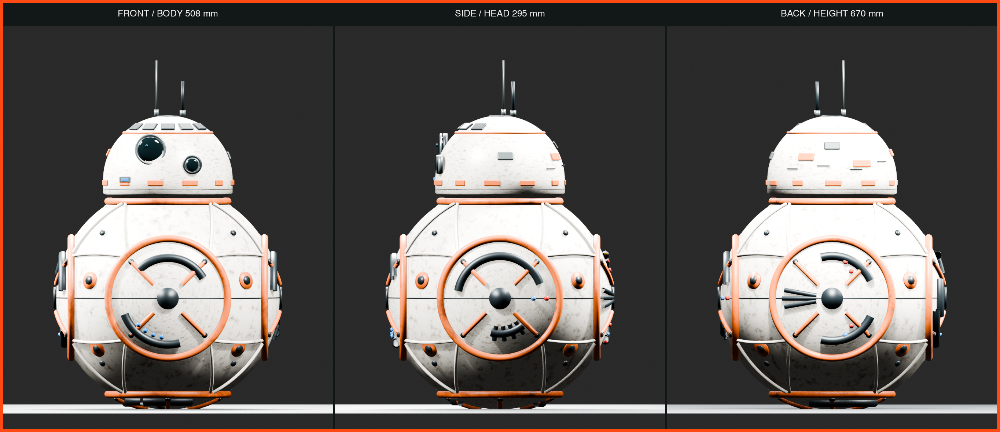

# BB-8 & D-O 1:1 Assembly Guide

[中文在线装配网站](https://zhangyinxina-ui.github.io/bb8-do-assembly-guide/) · [English build guide](https://zhangyinxina-ui.github.io/bb8-do-assembly-guide/en/) · [权利与再分发边界](NOTICE.md)

一个面向个人制作者的公开工程记录：包含《星球大战：原力觉醒》BB-8 的 1:1 屏幕参考 Blender 模型、三视图、内部运动机构、运动学/动力学验证、控制器草案，以及 D-O 合法公开资源和采购门控路线。



## 当前基准

- BB-8 身体球：Ø508 mm。
- 头部最大直径：Ø295 mm。
- 无天线总高：670 mm，对齐 StarWars.com 公开的 0.67 m。
- Blender 主工程重开审计：363 个总对象、159 个内部对象，其中 150 个制造对象和 9 个非制造工程标记。
- 阶段14质量账本：名义8.463 kg、名义质心z=-56.2 mm、最不利角点z=-27.7 mm；0.6 N·m连续扭矩按2×余量时目标加速度降额为0.70 m/s²。17组质量仍需实物称重。
- 双轮差速内车、310 mm 轮距、6+6 磁体随动头和 40 N 装机拉脱力验收合同。
- 编码器轮速 PI + IMU 偏航闭环仿真：直线 RMS 误差 0.00772 m/s、转角 91.20°，传感器过期同周期撤销 PWM。
- ESP32-S3 已编译双正交编码器与 MPU6050 适配；CPR默认为0、静止标定未完成时保持拒动。
- 双 INA226 电流适配、开漏 ALERT、显式限值、过流/堵转回放与11类锁存故障已编译验证；阶段19将原ALERT→EN假设改为适配MDD20A的ALERT_N→PWM许可级，实体测试仍为 `NOT_RUN`。
- 阶段15新增左右电机驱动包络、双散热器、主保险丝、常开接触器、双通道常闭急停、安全继电器、维护断电与系留急停插口；3°动态坡道解析点为0.289 N·m/电机、2.07×连续扭矩裕量和4.22°合成倾角。器件型号与实体测试仍未冻结。
- 阶段16新增19项强制真机调试门、固定字段ESP32遥测解析器和带文件SHA-256的证据审计；当前结果为 `HOLD_PHYSICAL_TESTS_NOT_RUN`，0/19通过。
- 阶段17用厂商官方资料筛选MDD20A、30 A MIDI保险丝、SW60接触器和P28A 4S2P候选；15/15额定检查通过，但因堵转、再生、独立去能适配、BMS与电池包未冻结，结果保持 `HOLD_COMPONENT_FREEZE_MEASUREMENTS_REQUIRED`。
- 阶段18完成REC Active BMS 4S、MDD20A、SW60、MIDI保险丝、外置分流器与双通道门板的模块化电源舱解析布局，并已写入唯一Blender主工程；重开审计确认363个总对象、159个内部对象、150个制造对象、9个工程标记和39个阶段18对象。8个候选包络满足球壳/候选/既有机构间隙门，但12项实物尺寸与接口仍未冻结，结果保持 `HOLD_PHYSICAL_FIT_AND_INTERFACE_VALIDATION_REQUIRED`。
- 阶段19发布双许可PWM门预CAD设计：SAFE_A、SAFE_B、双INA226 `ALERT_N`与3.3 V掉电均可独立阻断左右PWM；64/64真值组合和电气/机械解析检查通过，但没有KiCad、Gerber或台架波形，结果保持 `HOLD_PCB_CAD_BENCH_AND_SAFETY_VALIDATION_REQUIRED`。
- 24 步装配指南与19项真机门；浏览器进度不能替代真机证据。

这些拆分尺寸和外观细节来自公开画面、社区摄影测量和制作者资料，不是 Lucasfilm 官方 CAD，也不应宣称逐毫米复制电影道具。

## 仓库结构

| 路径 | 内容 |
| --- | --- |
| `blender/` | 参数化生成器、主工程、阶段检查点、审计和导出脚本 |
| `engineering/` | 物理输入、计算结果、D-O 清单和采购门控 |
| `firmware/` | BB-8 C++ 控制核心与 ESP32-S3 适配草案 |
| `docs/` | 从阶段 1 到阶段 19 的中英文设计、验证和续接记录 |
| `hardware/` | 阶段19双许可PWM门预CAD合同与OpenSCAD机械包络；不含Gerber |
| `app/` | Vinext/Next 开发网站 |
| `github-pages-src/` | GitHub Pages 纯静态 React 入口 |
| `public/` | 网站公开的图像、GLB、STL、CSV 和说明文件 |
| `tools/` | 运动学、物理、磁耦合、真机证据、D-O 与 Pages 审计工具 |

## 本地运行

要求 Node.js 22.13.0 或更高版本、Python 3，以及可选的 Blender 5.1.x。

```bash
npm ci
npm run dev
```

构建并审计 GitHub Pages 静态网站：

```bash
npm run build:pages
```

完整网站回归测试：

```bash
npm test
npm run lint
```

主要工程验证：

```bash
python3 tools/verify_kinematics.py
python3 tools/verify_physics.py
python3 tools/verify_multibody.py
python3 tools/verify_differential_turn.py
python3 tools/verify_motor_selection.py
python3 tools/verify_magnetic_coupling.py
python3 tools/verify_mass_properties.py
python3 tools/verify_stability_envelope.py
python3 tools/verify_commissioning_evidence.py
python3 tools/verify_power_component_selection.py
python3 tools/verify_power_cassette_layout.py
python3 tools/verify_dual_permissive_gate.py
python3 tools/audit_do_resources.py
sh tools/run_closed_loop_sim.sh
```

阶段 10 的闭环运动证据见 [编码器 / IMU 闭环运动仿真](docs/BB8_阶段10_闭环运动仿真.md) 和 [200 Hz 遥测](engineering/closed_loop_telemetry.csv)。软件仿真通过不等于真机地面验收。

阶段 11 的传感器代码、默认拒动策略和上电标定顺序见 [ESP32 编码器与 MPU6050 适配](docs/BB8_阶段11_ESP32传感器适配.md) 与 [机器可读接口合同](engineering/sensor_adapter_contract.json)。

阶段 12 的双 INA226、开漏ALERT、显式限值和故障回放见 [电流保护与堵转回放](docs/BB8_阶段12_电流保护与堵转回放.md)、[机器可读电流合同](engineering/power_safety_contract.json) 和 [5 ms回放记录](engineering/power_safety_replay.csv)；当时的EN假设已由阶段19适配为MDD20A的PWM硬件门。

阶段 13 把这条保护链落实到110件内部总成，见 [电流保护硬件建模与重开审计](docs/BB8_阶段13_电流保护硬件建模.md) 和 [110件装配尺寸清单](engineering/internal_assembly_manifest.csv)。

阶段 14 增加可拆卸密封低位配重盒，并以17组质量账本、全部最小/最大角点和刚体惯量替代旧110 mm假设，见 [中文验证报告](docs/BB8_阶段14_质量质心与惯量验证.md)、[English validation report](docs/BB8_stage14_mass_cg_inertia_validation.md) 和 [当前内部装配清单](engineering/internal_assembly_manifest.csv)。

阶段 15 把驱动器与硬件去能链落实为30个新内部对象，并新增斜坡、牵引、转弯、倾角和磁头合载荷扫描，见 [中文阶段15报告](docs/BB8_阶段15_驱动电源与动态稳定性.md)、[English Stage 15 report](docs/BB8_stage15_drive_power_dynamic_stability.md) 和已由阶段18重导出的 [150件制造清单](engineering/internal_assembly_manifest.csv)。未提供机械驻车制动，因此断电坡道保持明确为不支持。

阶段 16 不新增 `.blend` 副本，而是把真实硬件运行转换为19项可审计门：固定字段串口遥测、测量值、证据文件和SHA-256必须同时存在，空填PASS会被拒绝。见 [中文阶段16报告](docs/BB8_阶段16_真机调试证据门.md)、[English Stage 16 report](docs/BB8_stage16_physical_commissioning_evidence_gate.md)、[测试矩阵](engineering/commissioning_test_plan.json)、[证据模板](engineering/commissioning_evidence.json) 和 [当前HOLD结果](engineering/commissioning_results.json)。

阶段 17 将通用电气包络收敛为官方资料支持的候选，但不越过实物证据边界：MDD20A额定裕量足够，却没有独立EN且再生路径未冻结；30 A MIDI必须用堵转波形做I²t配合；SW60普通续流二极管的35 ms典型释放时间超出20 ms合同；4S BMS尚未冻结。见 [中文阶段17报告](docs/BB8_阶段17_驱动电源器件选型门.md)、[English Stage 17 report](docs/BB8_stage17_drive_power_component_selection_gate.md)、[候选矩阵](engineering/power_component_candidates.json) 和 [当前HOLD结果](engineering/power_component_selection_results.json)。

阶段 18 将候选器件收敛为可拆卸模块化驱动电源舱：REC Active BMS 4S按111 × 135 × 44 mm外壳、MDD20A按88.90 × 78.74 mm官方板框、SW60按81 × 37 × 28.1 mm包络进入解析布局。当前最小球壳余量27.643 mm、候选件间隙7.500 mm、与既有机构间隙6.000 mm；这些只证明数字包络未冲突，不代替实物孔位、接插件、线束弯曲、散热与维护验证。几何已覆盖保存到唯一主工程并在重开后通过审计，主文件SHA-256为 `3b774f3e02c89e15922aac48629a43d4765d37078acad88ccf34f6316827d5c3`。见 [中文阶段18报告](docs/BB8_阶段18_模块化驱动电源舱布局门.md)、[English Stage 18 report](docs/BB8_stage18_modular_drive_power_cassette_layout_gate.md)、[布局输入](engineering/stage18_power_cassette_layout.json) 和 [当前HOLD结果](engineering/stage18_power_cassette_results.json)。

阶段 19 将门板占位收敛为预CAD参考设计：2个VO617A-4隔离SAFE_A/B，3片SN74LVC2G08依次门控SAFE_A、SAFE_B和双INA226 `ALERT_N`；2.00 kΩ/0.5 W输入支路在12.0–16.8 V解析为5.175–7.900 mA，64行真值表证明任一许可丢失均使两路PWM为低。OpenSCAD只给板框和器件包络，本阶段没有KiCad、ERC/DRC、Gerber、实装板或20 ms示波器证据。见 [中文阶段19报告](docs/BB8_阶段19_独立双许可PWM硬件门.md)、[English Stage 19 report](docs/BB8_stage19_independent_dual_permissive_pwm_gate.md)、[机器合同](engineering/stage19_dual_permissive_gate_contract.json) 和 [当前HOLD结果](engineering/stage19_dual_permissive_gate_results.json)。

## D-O 公开资源边界

仓库不冒充拥有 D-O 整机机械文件：

- Printed Droid 公开仓库固定审计到提交 `e90aacdbe26a62fd4f0229d5504a3f2f3c409055`。
- 公开仓库包含 5 个 Arduino 草图，但整机机械 CAD/STL 数量为 0。
- v1.1、v2.1、v3.4 使用个人非商业条款，不能笼统称为 OSI 开源。
- Mr Baddeley D-O V2 机械包属于付费资源，本仓库不包含。
- 许可不明确的调试支架、第三方 PDF、本地工具链和编译缓存不会推送到 GitHub。

详见 [D-O 资源审计与自组入口](docs/DO_资源审计与自组入口.md)、[D01-D16 自组路线](docs/DO_自组采购与调试路线.md) 和 [24 项采购门控 BOM](engineering/do_self_build_bom.csv)。

## 自动部署

推送到 `main` 后，`.github/workflows/deploy-pages.yml` 会：

1. 安装固定依赖；
2. 构建 `/bb8-do-assembly-guide/` 子路径静态站点；
3. 扫描本机绝对路径、GitHub 令牌和禁止发布的 `.blend` 网站副本；
4. 上传 Pages artifact 并部署到 GitHub Pages。

## 免责声明

这是非官方粉丝研究、个人教育和工程原型。STAR WARS、BB-8、D-O 及相关角色归各自权利人所有。除非文件单独声明许可证，本仓库公开可见不等于自动授予商用、复制或再分发许可。使用前请阅读 [NOTICE.md](NOTICE.md)。
