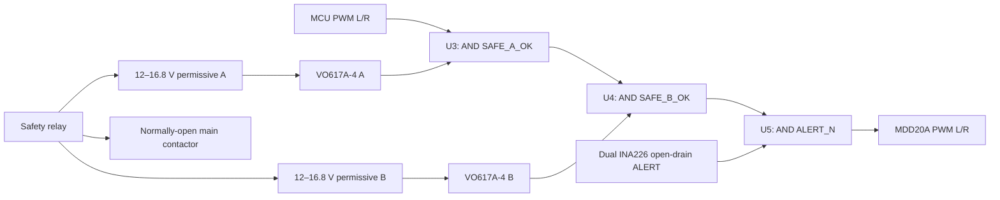

# Stage 19 dual-permissive PWM gate — schematic/ERC reference design

This package replaces the Stage-18 empty gate-board placeholder with a reviewable electrical contract, deterministic KiCad 10 schematic and mechanical envelope. KiCad 10.0.4 reports **0 ERC violations**, and the exported 34-reference/91-pin/21-net connectivity matches the canonical CSV. It is deliberately **not a fabrication release**: there is no independent schematic peer review, routed PCB, DRC, Gerber, assembled board or bench waveform.

## Intended function

Both outputs follow:

`PWM_OUT = LOGIC_POWER_OK AND PWM_IN AND SAFE_A_OK AND SAFE_B_OK AND ALERT_N`

Either safety channel, a current ALERT, or loss of 3.3 V forces both PWM outputs low. `DIR_L` and `DIR_R` pass through directly and are not safety signals. The contract therefore requires MDD20A sign-magnitude mode, where PWM low is brake.

The board provides six declared test points: `SAFE_A_OK`, `SAFE_B_OK`, `ALERT_N`, `PWM_L_OUT`, `PWM_R_OUT` and `GND`. The PCB-plus-component envelope is 11.4 mm; including the 3.0 mm insulated mounting stack gives 14.4 mm installed height and only 0.6 mm analytical margin inside the Stage-18 keepout.

## Safety boundary

- PWM low is braking, not energy isolation. The independent safety relay and normally-open contactor must still remove the motor bus.
- This is not a safety PLC, certified safety relay or redundant safety controller. Shared power, PCB, connectors, logic packages and the motor driver remain common-cause paths.
- The VO617A-4 CTR and saturation checks in this repository use the manufacturer's 25 °C test points. Its saturated 25 µs turn-off is a typical value, not a guaranteed maximum.
- An open `ALERT_N` wire can be pulled high by R13; that path is not fail-safe. Commissioning must test the sensor harness and MCU freshness latch separately.
- Do not fabricate or energise from these files. The formal schematic and ERC are complete, but an independent peer review, PCB layout/DRC and intentional Gerber release must happen before Stage-E02 bench tests.

## Files

- `engineering/stage19_dual_permissive_gate_contract.json` — source-of-truth requirements and official references.
- `engineering/stage19_gate_netlist.csv` — pin-level connectivity contract.
- `engineering/stage19_gate_bom.csv` — provisional BOM; many passives remain manufacturer-TBD.
- `engineering/stage19_gate_truth_table.csv` — all 64 input combinations.
- `engineering/stage19_dual_permissive_gate_results.json` — analytical result and unresolved release gates.
- `stage19_dual_permissive_gate.kicad_sch` / `.kicad_pro` — formal KiCad 10 schematic project; no PCB is present.
- `stage19_symbols.kicad_sym` — project-local custom MCU-header and VO617A-4 symbols used by the deterministic capture.
- `engineering/stage19_kicad_erc.json` — KiCad 10.0.4 ERC export with zero violations.
- `engineering/stage19_kicad_netlist.xml` / `stage19_kicad_bom.csv` — machine-audited connectivity and KiCad BOM exports.
- `output/pdf/BB8_stage19_dual_permissive_gate_schematic.pdf` — reviewed one-page A4 schematic rendering.
- `tools/verify_stage19_kicad.py` — regenerates, runs ERC/exports and cross-audits the canonical netlist without granting fabrication release.
- `tools/verify_dual_permissive_gate.py` — deterministic evaluator.
- `board_envelope.scad` — deterministic component-envelope model source. The local OpenSCAD 2021.01 CLI did not complete a headless export, so no STL is claimed in this stage.

## Required next tests

1. Independent peer review of the captured KiCad schematic and its safety assumptions.
2. PCB placement/routing, creepage/courtyard review and DRC.
3. Gerber/drill plot review before any manufacturer order.
4. Unpowered continuity and polarity inspection.
5. 12.0 V and 16.8 V corner tests for `SAFE_A` and `SAFE_B` independently.
6. Oscilloscope proof that each safety channel, `ALERT_N`, logic-power loss and MCU stuck-high drive both PWM outputs low within 20 ms.
7. 20 kHz PWM integrity, temperature, vibration, connector retention and EMC checks.
8. Combined safety-relay/contactor/PWM-gate Stage-E02 evidence.
